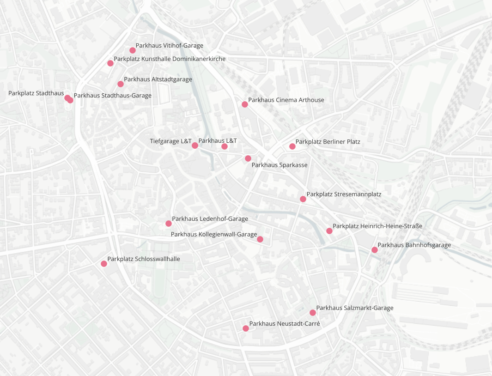

Twitter-Bot Parkhäuser Osnabrück und Bicycle Counter :bicyclist:
=====================================================

Willkommen bei [Verkehrswatch-OS](https://twitter.com/VerkehrswatchOS), einem Projekt vom [Radentscheid Osnabrück](https://radentscheid-os.de). Die Inspiration für dieses Projekt kam vom Münsteraner Pendant [VerkehrswatchMS](https://twitter.com/verkehrswatchms)

Das Ziel dieses Tools ist es öffentlich zugängliche und verkehrsrelavante Daten zu sammeln und auf Twitter zu zeigen.

Folgende Quellen werden angezapft:

## Parkhäuser Osnabrück

Parken im öffentlich Raum verbraucht viel Platz, der gerade in der Innenstadt auch anderen Verkehrsarten, wie dem Fuß- oder Radverkehr, zugesprochen werden könnte. Daher möchten wir aufzeigen, dass es in Osnabrück bereits viele Parkmöglichkeiten in Parkhäusern gibt und diese auch sehr oft nicht ausgelastet sind. Innerstädtische Parkplätze könnten somit ersatzlos gestrichen und der Raum anderen Verkehrsarten zur Verfügung gestellt werden.

2 mal täglich werden die aktuell frei verfügbaren Parkplätze getwittert. Ab 23.01.2023 werden nur noch Parkhäuser im bzw. am Rand des Wallrings ausgewertet. Dadurch sollte sich die Anzahl der verfügbaren Parkplätze verringern. Folgende Parkhäuser werden für Twitter ausgewertet:



|name|address|longitude|latitude|
|----|-------|---------|--------|
|Parkhaus Bahnhofsgarage|Bahnhofs-Garage, Theodor-Heuss-Platz, 49074 Osnabrück|8.059507|52.2714829|
|Parkplatz Berliner Platz|Parkplatz Berliner Platz, Kleiststraße, 49074 Osnabrück|8.053614|52.276016|
|Parkplatz Kunsthalle Dominikanerkirche|Parkplatz, Hasemauer 3, 49074 Osnabrück|8.040564|52.279661|
|Parkhaus Altstadtgarage|Lohstraße 11, 49074 Osnabrück|8.041294|52.278756|
|Parkplatz Haarmannsbrunnen|Haarmannsbrunnen, Herrenteichswall 2, 49074 Osnabrück|8.048747|52.276018|
|Parkhaus Neustadt-Carré|Neustadt Carré, Kommenderiestraße, 49074 Osnabrück|8.050286|52.268042|
|Parkhaus Kollegienwall-Garage|Am Landgericht 2, 49074 Osnabrück|8.051323|52.271952|
|Parkhaus Ledenhof-Garage|Ledenhof-Garage, Alte Münze 18, 49074 Osnabrück|8.04474|52.272644|
|Parkplatz Schlosswallhalle|Stellplatz Osnabrück City, Schnatgang 6, 49080 Osnabrück|8.040123|52.270871|
|Parkhaus Salzmarkt-Garage|Salzmarkt-Garage, Holtstraße 37, 49074 Osnabrück|8.055086|52.268722|
|Parkhaus Stadthaus-Garage|Stadthaus-Garage, Natruper-Tor-Wall 2, 49076 Osnabrück|8.037697|52.278044|
|Parkplatz Stadthaus|Stadthaus-Garage, Natruper-Tor-Wall 2, 49076 Osnabrück|8.037495|52.278156|
|Parkhaus Vitihof-Garage|Vitihof-Garage, Gerberhof 10, 49074 Osnabrück|8.042148|52.280237|
|Parkhaus Sparkasse|Schillerstraße 21, 49074 Osnabrück|8.05045|52.275491|
|Parkplatz Heinrich-Heine-Straße|Heinrich-Heine-Straße, 49074 Osnabrück|8.056268|52.272313|
|Parkhaus Cinema Arthouse|Karlstraße 8, 49074 Osnabrück|8.050225|52.277859|
|Parkhaus L&T|Herrenteich Straße, 49074 Osnabrück|8.046636317986193|52.27605989377632|
|Tiefgarage L&T|Herrenteich Straße, 49074 Osnabrück|8.046642574460018|52.27605223763358|
|Parkplatz Stresemannplatz|Schlagvorder Straße, 49074 Osnabrück|8.0543955|52.2737128|


Zusätzlich wird die Verfügbarkeit stündlich abgefragt und für weitere Auswertungen gespeichert. Die Daten ab März 2021 sind hier unter [Parkhaus-Daten](./Parkhaus-Daten/) hinterlegt.

Quelle: https://www.parken-osnabrueck.de/

## Fahrradzählstellen

In Osnabrück gibt es aktuell 2 Fahrradzählstellen, eine an der Katharinenstraße und eine am Anfang vom Radschnellweg von Osnabrück nach Belm. Aktuell wird einmal im Monat die Anzahl der Radfahrenden des vergangen Monats ausgelesen und zusammen mit den Zahlen der letzten 2 Jahre auf Twitter geteilt.

Quelle: 
- Katharinenstr: https://data.eco-counter.com/public2/?id=300018001
- Radschnellweg Belm - OS: http://rswosnabelm.eco-counter.com/

## Parkhaus-Daten

Ab März 2021 wird stündlich die Belegung der Osnabrücker Parkhäuser abgefragt und werden nun hier für weitere Auswertungen zur Verfügung gestellt. Es gibt die Daten in 2 Formaten, einmal csv-Datei für die Weiterarbeitung in Excel oder als sqlite-Datenbank. Im Datensatz befinden sich 2 Tabellen.
Die Daten werden wöchentlich automatisch aktualisiert.

### Tabelle 1: Parkhaus-Infos`ramps_details`

| Spalte | Bedeutung |
|--------|---------- |
| id | Parkhaus-ID |
| name | Name |
| street | Straße |
| zipcode | Postleitzahl |
| city | Stadt |
| latitude | geografische Breite |
| longitude | geografische Länge |
| address | komplette Adresse |
| city_center | Parkhaus befindet sich im Zentrum (innerhalb oder Nähe Wallring | 

### Tabelle 2: Auslastung `ramp_utilization`

| Spalte | Bedeutung |
|--------|---------- |
| id | fortlaufende ID |
| ramp_id | ID des Parkhauses (siehe `ramps_details`) |
| capacity | Kapazität |
| utilization | Aktuelle Auslastung |
| utilization_ratio | prozentuale Auslastung |
| available | Aktuell verfügbare Parkplätze |
| created_at_utc | Zeitstempel in UTC (+0) |

## Tool 

### Setup


- create python virtual environment
```
virtualenv -p python3 --system-site-packages venv
```

- activate venv
```
. venv/bin/activate
```

- install libraries
```
venv/bin/pip3 install -r requirements.txt 
```

- install verkehrswatch_os
```
pip install -e .
```

- create config.py and enter own credentials and configuration
```
cp verkehrswatch_os/base/config.template verkehrswatch_os/base/config.py
```

- run script
```
python verkehrswatch_os/tweet_parking_ramps.py 
python verkehrswatch_os/store_parking_ramp_data.py 
python verkehrswatch_os/twee_bicycle_counter.py -m
```


### Ramp Availability

```
python verkehrswatch_os/tweet_parking_ramps.py 
```

```
python verkehrswatch_os/store_parking_ramp_data.py 
```

### Bicycle Couter


python verkehrswatch_os/twee_bicycle_counter.py [OPTIONS]

```
usage: tweet_bicycle_counter.py [-h] [-m]

Twitter-Bot für Fahrradzählstellen in Osnabrück

optional arguments:
  -h, --help     show this help message and exit
  -m, --monthly  Tweet monthly bicylce count
```

## TODO:
- Parkhausbelegung in Diagramm darstellen und wöchentlich twittern
- Anzahl der Radfahrenden im aktuellen Jahr (2 wöchentlich)
- auf Mastadon tröten
